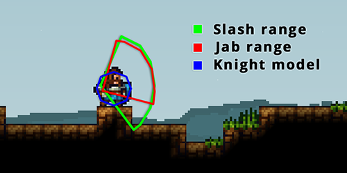

# Knight II: Intermediate

  

## Knight model, slash and jab range

We'll start this section with a word about hitboxes in KAG:

  

The hitbox of a knight is an octagon.

Both jab and slash are shaped as arcs, which move with your character and are active for a certain duration (slashes last much longer than jabs).

Your shield covers an arc around your character centred on the direction you point your mouse. If you were hit through your shield by someone – ask yourself if you were pointing in the right direction to cover the full arc of the attack.

It is possible to see your hit boxes by going into solo sandbox mode, opening the console (by pressing HOME key) and typing `/g_debug 1`.

## On learning itself

If you want to get better at knight quickly, a good choice is to play a lot of TDM, but in our opinion the __best way to train is to play lots of 1v1s__ -- sometimes with people at your skill level and sometimes with people slightly better than you. 1v1s are the best for this because they allow you to fully focus on the knight combat, while in TDM you have to watch out for archers (and water bombs, which aren't used in 1v1s) or in CTF -- you are more focused on winning the game, not KDR.

You should always try to be as consistent as possible. For a lot of moves, you just need to get into the habit of using them. If you really want to get better, we recommend always focusing and actually *trying*, no matter who you are playing against or what mode it is; playing optimally helps you  in training muscle memory and getting used to the mechanics of knight combat. This applies to anyone, no matter you skill at knight -- you should always give your best. Doing this will make you a better player.

As mentioned in the first chapter, analysing your play style and mistakes also helps a lot. It may be hard to do it in real-time, so you may decide to record your gameplay and analyse the videos later. We suggest recording your 1v1 gameplay.

In Summary -- don't stop trying, always give your best, and try to use the moves and tricks you learned here in actual matches, don't be afraid to experiment with your play style.

## More on mobility

At this point, it would be good to learn basic mobility tricks, such as these (taken from the [Knight Compendium](https://deynarde.github.io/kag-knight-compendium/) mentioned earlier) -- they're useful in more situations than you may think, so you should be able to do them consistently. Good mobility is as important as good timings and reflexes.

### Slash jumping

A knight can jump higher than normal by slashing to give extra velocity. Time your slash so that it triggers just after you start your jump. It can be combined with an upwards shield glide in order to get extra height. By pushing off the wall as you near the top and then floating back onto, you can also climb an extra block -- in total up to 8 blocks. This can be useful when you're escaping from the enemies' base with their flag.

<video style="display:block; max-width:100%; height:auto;" src="webm/02-good/1.webm" controls loop="loop" preload></video> 

You can also do the same with a double slash -- a total of 10 blocks can be climbed this way.

<video style="display:block; max-width:100%; height:auto;" src="webm/02-good/2.webm" controls loop="loop" preload></video> 

### Faster movement during slash charging

Aiming in the same direction to which you are moving will allow you to move a little faster while charging an attack. __You should always do this!__

<video style="display:block; max-width:100%; height:auto;" src="webm/02-good/3.webm" controls loop="loop" preload></video> 

### Quick shield slide

Shield sliding is performed by pointing the mouse below your character and shielding. But you can move significantly faster by __rapidly tapping the W key as you slide.__ For maximum speed, try to hit W as soon as you hit the ground on each bounce. Shield sliding is very useful when you're escaping from several enemies, or from an enemy charging a double slash.

<video style="display:block; max-width:100%; height:auto;" src="webm/02-good/4.webm" controls loop="loop" preload></video> 

### Climbing arrows

It is possible to climb arrows that have been shot into blocks. It is also possible to navigate around platforms on towers if there are enough arrows.

<video style="display:block; max-width:100%; height:auto;" src="webm/02-good/5.webm" controls loop="loop" preload></video> 

### Using walls for extra velocity

Pushing off a wall will give you a small burst of speed. This speed boost can be extremely helpful to win a 1v1 by utilising slash timings. This technique is very good against people playing defensively.

<video style="display:block; max-width:100%; height:auto;" src="webm/02-good/8.webm" controls loop="loop" preload></video> 

### Following a retreating enemy through doors

After an enemy player runs through his team's doors, the doors are momentarily left open. This can give you enough time to walk through them. You can often get to enemy shops or flags using this in a CTF game.

<video style="display:block; max-width:100%; height:auto;" src="webm/02-good/9.webm" controls loop="loop" preload></video> 

### Water buoyancy

If you wall-climb while underwater you receive a significant speed boost. This can be very useful for surprising your enemy with an upwards slash.

<video style="display:block; max-width:100%; height:auto;" src="webm/02-good/10.webm" controls loop="loop" preload></video> 

### Small shield glide

A shield slide can be performed even on a single block. This can be very helpful in CTF to get some extra speed for crossing larger gaps.

<video style="display:block; max-width:100%; height:auto;" src="webm/02-good/11.webm" controls loop="loop" preload></video> 

### Slash escape

Slashing can sometimes be used as an escape mechanism due to the small speed boost it gives.

[new giffo ura]

### Tower wall jump

This is a good way to get some extra horizontal distance when jumping off a tower. To do it, slightly drop off the tower and push off while shield gliding.

<video style="display:block; max-width:100%; height:auto;" src="webm/02-good/13.webm" controls loop="loop" preload></video> 

### Bounce off water

Shield sliding onto water will allow you to do a little bounce before you sink. This can be useful for quickly moving over water.

<video style="display:block; max-width:100%; height:auto;" src="webm/02-good/14.webm" controls loop="loop" preload></video> 

### Bomb jumps

Mentioned in [Knight I: The basics], a bomb jump is when knights use bombs to send themselves flying into the air. The simplest bomb jump is a single bomb jump. To perform a single bomb jump, light the bomb, drop it on the ground and as it is about to explode, jump into the air and shield towards the bomb.

Timing is crucial to performing bomb jumps. If you time it so you jump and shield at the last possible moment you will go much further (sometimes almost twice as far).

<video style="display:block; max-width:100%; height:auto;" src="webm/02-good/15.webm" controls loop="loop" preload></video> 

You can also perform bomb jumps midair:

<video style="display:block; max-width:100%; height:auto;" src="webm/02-good/16.webm" controls loop="loop" preload></video> 

Bomb jumps are good for getting around obstacles in CTF, so you should become very comfortable with them. You should always look for situations to utilise them to your advantage.

You can also do multi bomb jumps -- read more about them in [Playing CTF] section.

---

If you feel like your mobility is already decent enough, you can move to the next part -- learning more about combat itself and how to slay enemies properly. But before that, we'll talk about the best way to learn and how to optimize your play style.

---

## More on combat and using your sword

The three most important things at this level are:

### Slashing fast

As mentioned in chapter 1, this is very important. __You should be able to do slashes as soon as it's possible__ (after half a second -- watch your cursor for timings). The same applies to double slashes (38 ticks, that is 1.25 seconds).

### Jab after successful slashes

This may be obvious, but it is very rarely used by newer players, especially on CTF. You can __jab right after successfully slashing someone__ -- the slashed person is stunned for a short while (2/3s of a second) which allows you to land an additional jab in that time (thus dealing a total of 3 hearts of damage). You should almost always do this, the exception is when you're fighting several enemies at once -- this prevents accidentally jabbing someone's shield. In these situations you should generally focus on using slashes).

<video style="display:block; max-width:100%; height:auto;" src="webm/02-good/18.webm" controls loop="loop" preload></video> 

<video style="display:block; max-width:100%; height:auto;" src="webm/02-good/19.webm" controls loop="loop" preload></video> 

### Low jumps while slashing

This is another very important mechanic that you should get into the habit of using. You should almost always slightly jump while slashing -- doing this allows you to gain additional horizontal momentum, thus cover a larger distance, with the added benefit of making your sword's slash range longer (slash range depends on your momentum).

<video style="display:block; max-width:100%; height:auto;" src="webm/02-good/20.webm" controls loop="loop" preload></video> 

Keep in mind that your jumps should be small. A very common mistake people make is that they jump too far - jumping too high while slashing makes your slash range worse than if you would actually not jump at all (slashing below you when you're going up has a very small range), making it easier for enemies to slash you from below.

---
These are the 3 most important things at this level: slashing fast, jabbing after successful slashes and performing low jumps while slashing. Train these until it feels natural and you do it instinctively.
---
Additionally, there are a few more things you can keep in mind, such as:

### Using double slashes

Another common mistake is just constantly single slashing a shielding enemy. Some people use double slashes too rarely. Double slashes are a very good counter against defensive playstyles. Additionally, you can always land a jab after connecting with a double slash:

<video style="display:block; max-width:100%; height:auto;" src="webm/02-good/22.webm" controls loop="loop" preload></video> 

Be wary, double slashing can be countered by good players, but you'll learn more about it this in the next chapter.

Double slashes are also very good to use after doing a successful slash/jab combo. Once you perform a slash, your enemy is likely to put his shield up and start retreating. You can follow him and double slash for an easy follow up. Keep in mind that this many not work against better players -- they can just jab to break your charging animations.

<video style="display:block; max-width:100%; height:auto;" src="webm/02-good/23.webm" controls loop="loop" preload></video> 

### Attacking an enemy who is stunned from jabbing your shield

If an enemy makes the mistake of jabbing your shield, you can pretty much always follow up with some damage. You should get into the habit of doing this.

There are 3 ways dealing damage to him. If someone jabs a shield, he's stunned for 2/3s of a second - that is plenty of time to deal your damage.

1. Slashing -- This option is the best and should be utilised the most often. As soon as you notice the person has been stunned, start charging a single slash. If you're fast enough, you should always be able to land a slash on the enemy (Remember to follow it up with a jab if your slash connected.)

<video style="display:block; max-width:100%; height:auto;" src="webm/02-good/24.webm" controls loop="loop" preload></video> 

2. Jabbing -- If you don't have the confidence to perform slashes quickly, you can use a single jab. Keep in mind the earlier option superior to this one and you should eventually learn to utilise it.

<video style="display:block; max-width:100%; height:auto;" src="webm/02-good/25.webm" controls loop="loop" preload></video> 

3. Double jabbing -- Furthermore, you can land two jabs on an enemy stunned by shield jabbing. To do this, start rapidly clicking as soon as you notice the enemy has been stunned. However, keep in mind this is much harder and more risky than just a slash and also deals less damage (2 hearts from the jabs instead of 4 hearts from a successful slash + jab). This technique requires good ping to perform consistently.

<video style="display:block; max-width:100%; height:auto;" src="webm/02-good/26.webm" controls loop="loop" preload></video> 

Using a double slash is pointless in these situations. The enemy will haves time to react and start shielding, so you will deal the same damage as you would by doing a single slash.

### Counter slashing

If you are against an aggressive player, a good way to beat them is to bait them to attack you with their slash or double slash. As they move towards you, you move backwards whilst charging your own slash. As their slash ends, you move forwards and slash at them. You can do the same with a double slash or jab.

<video style="display:block; max-width:100%; height:auto;" src="webm/02-good/27.webm" controls loop="loop" preload></video> 

Tt is hard to counter a defensive play style which focuses on counter slashing. Counter slashing is also the best way to fight against several enemies at once - a typical combo includes; slash, retreat, slash, and so on.

[gif 29 - fighting against several enemies]

### Winning slash fights on L shape

In L shaped environmental situations, the knight who moves first (red in the image below) tends to lose the slash battle – even if red slashed earlier. This is because red have a larger vertical speed but almost no horizontal speed. The knight who moves second (blue) will have a large horizontal speed towards the enemy – and is thus far more likely to connect first and win the fight.

<video style="display:block; max-width:100%; height:auto;" src="webm/02-good/30.webm" controls loop="loop" preload></video> 

This situation often occurs in CTF when there are doors on top of towers.

It is worth mentioning that the L-shape situation usually favours the knight coming up from below. This is partly because you can move upwards more quickly than you can move sideways. Most of the knight’s body is shielded by the blocks going up the wall. In this GIF the blue and red knight arrive together at roughly the same time, but the blue knight wins. This is the typical outcome.

[gif 31]

## The art of shield bashing

As mentioned earlier, you can quickly shield slide horizontally into someone or shield down while jumping at an enemy to stun him for a short while -- about half a second. Shield bashing is most useful in narrow corridors where it cannot be countered by an overhead jab or slash.

<video style="display:block; max-width:100%; height:auto;" src="webm/02-good/32.webm" controls loop="loop" preload></video> 

Shield bashing is good for interrupting enemy slashes, but the beauty of shield bashes comes from being able to jab someone right after the shield bash connects.
Shield bashing is a very important aspect of knight combat -- being able to shield bash properly and follow up with attacks can make a big difference, especially when fighting against defensive players.

<video style="display:block; max-width:100%; height:auto;" src="webm/02-good/34.webm" controls loop="loop" preload></video> 

Alternatively, there are several ways to counter shield bashes, all of which you should learn. These include overhead slashing, overhead jabbing and crouching (which you'll learn more about in the next chapter.)

Jumping over the shield sliding enemy whilst charging a slash and then hitting them in the back (either with the charged slash or jab) is a consistent way to beat shield bashers. In some of the situations, the enemy won't even be able to put his shield back up, no matter what -- if you're shield sliding really fast there is a delay between sliding and shielding. However, this doesn't happen every time.

[gif 36 - overhead slash]

You can also do an overhead jab if you don't have enough time to charge a slash:

<video style="display:block; max-width:100%; height:auto;" src="webm/02-good/37.webm" controls loop="loop" preload></video> 

Keep in mind that in this variation, if the enemy manages to put his shield back up, you may get stunned due to jabbing his shield.

Again, don't be demotivated if this may seem a lot and it is hard for you to learn everything. Many good knights struggled with this - it takes them a while before it clicks and shield bashes just feel natural to them.

## Playing CTF

At this point it would be good fir you to read the section for [Playing CTF] as well.
