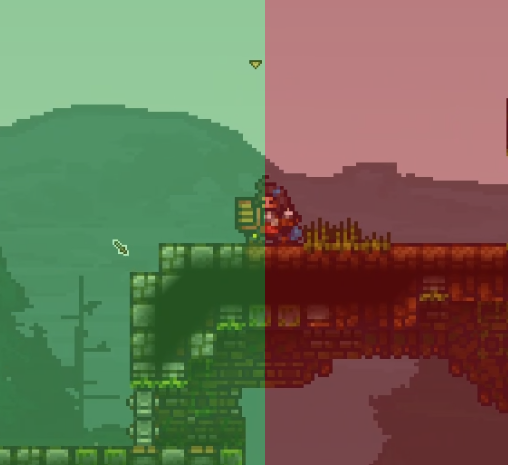

# Knight III: Advanced

  

## Crouching

This is another very important (and largely forgotten) feature in KAG. Basically, when you crouch (hold S) and don't move in any direction, enemies do not collide with you. This allows you to do lots of new situational moves. 

<video style="display:block; max-width:100%; height:auto;" src="webm/03-decent/1fix.webm" controls loop="loop" preload></video> 

Keep in mind that slashing moves you slightly, even if you stand still -- you have to re-crouch after releasing every slash.

### Countering shieldbashes

Aside from overhead attacks to counter enemies shield sliding into you, you can decide to crouch instead. The sliding enemy just goes through you and you can surprise them with an attack right after. You can actually crouch while doing any actions -- even shielding or slashing, as long as you don't move. Any time you move, you have to press S again after that to keep crouching. Keep in mind that there are no seperate animations for crouching while slashing or shielding.

<video style="display:block; max-width:100%; height:auto;" src="webm/03-decent/2,.webm" controls loop="loop" preload></video> 

### Countering stomps

Crouches are a very good counter against stomps as well. If you see someone jumping at you from a distance with their shield down, or if it's an archer or a builder, you should always crouch.

<video style="display:block; max-width:100%; height:auto;" src="webm/03-decent/crouchone.webm" controls loop="loop" preload></video> 

<video style="display:block; max-width:100%; height:auto;" src="webm/03-decent/3.webm" controls loop="loop" preload></video> 

### Countering crouches with slash + stomp

However, if you have height advantage, you can counter a crouching+shielding enemy by slashing them right before landing on them. In this case, the slash will stun them and you'll be able to stomp them. Also see: [Slash stomping (easy version)] later this chapter. If you're the one without height advantage fighting a knight that slashes a lot, they're likely to do this, so in that case you may want to not crouch.

In this gif, the person we're attacking is constantly trying to crouch.

<video style="display:block; max-width:100%; height:auto;" src="webm/03-decent/voice.webm" controls loop="loop" preload></video> 

### Countering crouches (equal level)

If you're on the same ground level as your enemy and you notice that they're crouching (either trying to protect themselves from a shieldbash or trying to bait you into walking into them), you can try to walk into them and quickly attack before they attack you.

<video style="display:block; max-width:100%; height:auto;" src="webm/03-decent/verysad1.webm" controls loop="loop" preload></video> 

### Attacking while being 'inside' someone that's shielding

If you or your enemy walk into each other due to crouches, you can make use of that and attack them (with a jab or a slash). However, if they're shielding, it requires you to slash or jab in a specific direction.

**You must attack in the direction they're shielding, or instead their shield will protect them from the attack.**

For example, in the image below -- we're inside the red enemy knight. Attacking to the left, top left or bottom left will hit the enemy, but attacks in the opposite directions will be shielded by them. This is because the jab's range doesn't start at the edge of the jab, but rather at the handle of the sword.

Some gifs demonstrating this:

<video style="display:block; max-width:100%; height:auto;" src="webm/03-decent/dim1.webm" controls loop="loop" preload></video> 

<video style="display:block; max-width:100%; height:auto;" src="webm/03-decent/dim2.webm" controls loop="loop" preload></video> 

<video style="display:block; max-width:100%; height:auto;" src="webm/03-decent/dim3.webm" controls loop="loop" preload></video> 

<video style="display:block; max-width:100%; height:auto;" src="webm/03-decent/dim4.webm" controls loop="loop" preload></video> 

The best way is to attack is to always just aim in the same place the enemy is aiming their shield towards.

If you're fighting against a player who knows this technique, you can prevent them from damaging you by rapidly changing your direction of shielding. For example, I didn't manage to do a 2nd jab on the enemy in the gif below due to them moving their shield around rapidly.

<video style="display:block; max-width:100%; height:auto;" src="webm/03-decent/rapid.webm" controls loop="loop" preload></video> 

Sometimes your enemy may be running into you with their shield up -- this usually happens in narrow spaces. A good trick is to slightly move back and crouch, so that the enemy phases through you. As they get inside you, start moving in the direction they're moving and  attack them while aiming in the proper direction.

<video style="display:block; max-width:100%; height:auto;" src="webm/03-decent/9.webm" controls loop="loop" preload></video> 

If you're countering a shieldbash or a stomp with a crouch, you want to slash down when the enemy phases into you (they're shielding down, so you want to slash in that direction).

<video style="display:block; max-width:100%; height:auto;" src="webm/03-decent/sd1.webm" controls loop="loop" preload></video> 

### Crouches in actual gameplay

In the gif below, our enemy is constantly shielding, so we're baiting them to walk into us.

<video style="display:block; max-width:100%; height:auto;" src="webm/03-decent/crouchslash1.webm" controls loop="loop" preload></video> 

If an enemy is on top of you, you can slash them and then stand still while crouching, and then slash (aiming downwards -- slash in the direction the enemy is shielding towards) to damage them when they phase into you. Generally we can crouch after every slash in narrow spaces or when we're at a slight height disadvantage in case the enemy tries to shieldbash or walk into us.

<video style="display:block; max-width:100%; height:auto;" src="webm/03-decent/crouchslash2.webm" controls loop="loop" preload></video> 

In the gif below, first we damage the enemies, and then when they start shielding we bait them to walk into us. After that we just have to slash in the proper direction (direction enemy is shielding towards) while following the enemies.

<video style="display:block; max-width:100%; height:auto;" src="webm/03-decent/crouchslash3.webm" controls loop="loop" preload></video> 

As soon as we notice that the enemy is trying to jump on us with their shield down, we start slashing while crouching and release the slash (aiming downwards) as soon as the enemy lands.

<video style="display:block; max-width:100%; height:auto;" src="webm/03-decent/crouchslash4.webm" controls loop="loop" preload></video> 

If we successfully slash an enemy knight and they get knocked upwards, they will likely try to fall down on us with their shield down. Crouch and slash after they're inside us.

<video style="display:block; max-width:100%; height:auto;" src="webm/03-decent/col.webm" controls loop="loop" preload></video> 

In the gif below, we predict that the enemy will try to move away from us so we get there first, crouch and then slash. Again, notice how we're slashing towards left -- as constantly mentioned, you want to slash in the direction the enemy is shielding towards.

<video style="display:block; max-width:100%; height:auto;" src="webm/03-decent/crouchslash5.webm" controls loop="loop" preload></video> 

Some more baiting so that the enemy goes through us.

<video style="display:block; max-width:100%; height:auto;" src="webm/03-decent/crouchslash6.webm" controls loop="loop" preload></video> 

Getting close to the enemy and then crouching. Even though crouching requires you to stand still, sometimes it can be just a very short while -- time your crouches well, try to surprise your enemy.

<video style="display:block; max-width:100%; height:auto;" src="webm/03-decent/crouchslash7.webm" controls loop="loop" preload></video> 

## Some more moves and tricks

### Jab trading (counterjabs)

If you get jabbed any time while not stunned from anything, you can always instantly jab right after before the enemy puts their shield up.

<video style="display:block; max-width:100%; height:auto;" src="webm/03-decent/jabtrade1.webm" controls loop="loop" preload></video> 

This is easiest to do if you are charging a slash or a double slash and get jabbed; in that case, just release left mouse button and start holding right mouse button (shielding) -- if your slash was recently interrupted, you'll just release a jab right after that.

<video style="display:block; max-width:100%; height:auto;" src="webm/03-decent/jarven.webm" controls loop="loop" preload></video> 

If you know that the enemy will counterjab you, you can also counterjab the counterjab (red knight in GIF below).

<video style="display:block; max-width:100%; height:auto;" src="webm/03-decent/countercounter.webm" controls loop="loop" preload></video> 

### Jabbing to interrupt double slashes

If you're in a situation when the enemy is constantly spamming slashes and you must shield yourself, they may eventually decide to charge a doubleslash. This can be countered: if you notice that they're charging for longer than usual -- a double slash instead of just a single slash, you can jab them and interrupt their slash.

<video style="display:block; max-width:100%; height:auto;" src="webm/03-decent/fakit.webm" controls loop="loop" preload></video> 

This can also be countered -- the person charging a double slash can do a counterjab, like mentioned in the section earlier.

<video style="display:block; max-width:100%; height:auto;" src="webm/03-decent/dcntr.webm" controls loop="loop" preload></video> 

To avoid this, you can try to always slightly jump away right after interrupting someone with a jab.

<video style="display:block; max-width:100%; height:auto;" src="webm/03-decent/xqc.webm" controls loop="loop" preload></video> 

The enemy will sometimes try to not be close enough for you to jab -- in some situations if you're fast enough and realise they're going to double slash your shield you can quickly run away with a quick shield slide, but if they're fast they can just slash you before you do that.

<video style="display:block; max-width:100%; height:auto;" src="webm/03-decent/112.webm" controls loop="loop" preload></video> 

### Prolonged slashes

If you know that the enemy knows how to interrupt double slashes with jabs and does it regularly, you can also prevent them from doing it. You can try charging a slash for a little longer than a perfect 16 tick (half a second) slash, but not as long as a double slash -- if you're lucky, the enemy will attempt a jab but you will slash them first (slashes have priority over jabs) and be able to damage them easily. 

<video style="display:block; max-width:100%; height:auto;" src="webm/03-decent/pro1.webm" controls loop="loop" preload></video> 

<video style="display:block; max-width:100%; height:auto;" src="webm/03-decent/pro2.webm" controls loop="loop" preload></video> 

<video style="display:block; max-width:100%; height:auto;" src="webm/03-decent/pro4.webm" controls loop="loop" preload></video> 

### Bait jab, punishing enemies for missing slashes

A bait jab punishes the enemy for missing their attack. As the enemy ends their slash, get close to them and quickly jab them. They won’t have time to shield.

<video style="display:block; max-width:100%; height:auto;" src="webm/03-decent/13.webm" controls loop="loop" preload></video> 

It's a good way to play against players who just slashspam -- bait them to jump at you with their slash, dodge it and then quickly jab right after.

<video style="display:block; max-width:100%; height:auto;" src="webm/03-decent/dodgejab.webm" controls loop="loop" preload></video> 

You can pretty much do this every time your enemy misses a slash but they're still close enough for you to jab.

<video style="display:block; max-width:100%; height:auto;" src="webm/03-decent/missjab.webm" controls loop="loop" preload></video> 

<video style="display:block; max-width:100%; height:auto;" src="webm/03-decent/missjab2.webm" controls loop="loop" preload></video> 

### Overhead jab

Mentioned already as a counter when your enemy attempts to shield bash you with a shield slide, but you can do it when the enemy is just walking forward with their shield up as well:

<video style="display:block; max-width:100%; height:auto;" src="webm/03-decent/145.webm" controls loop="loop" preload></video> 

Jump over the enemy’s head quickly and jab them before they can react and move their shield. Instead of clicking, you can also hold your mouse button for a short while until you are at the perfect point to release the jab.

### Tempo jab 

Often you will get into the situation where you are shielding and an enemy knight is repeatedly slashing you. Thus the other knight has the tempo advantage. If you try and slash them, then you will die as you will have begun charging your slash after them – so they will always be able to release earlier.

One way to escape this situation is with a quick jab – which will interrupt the enemy’s slash. 

<video style="display:block; max-width:100%; height:auto;" src="webm/03-decent/146.webm" controls loop="loop" preload></video> 

Beware though –- if you have only 1 heart, a good enemy will instantly counterjab you back for the kill. Also, there's a chance that the enemy will shield after slashing - worry not, you will learn what to do in this case in the next chapter.

### Fake jab

Sometimes, when you and the enemy are shielding each other, you may attempt to do a fake jab to make the enemy think you jabbed their shield, then start shielding right after, like in the gif:

<video style="display:block; max-width:100%; height:auto;" src="webm/03-decent/fakejab.webm" controls loop="loop" preload></video> 

If they will jab your shield, you're able to follow up with an attack (preferably a slash + jab).

### Slash stomping (easy version)

When you have height advantage over a shielding enemy (at least 3 blocks), you can jump down at them with a slash. The slash will pierce their shield and the additional velocity from slashing will let you stomp them for 1 heart of damage.

<video style="display:block; max-width:100%; height:auto;" src="webm/03-decent/147.webm" controls loop="loop" preload></video> 

You can jab after every successful slashstomp.

<video style="display:block; max-width:100%; height:auto;" src="webm/03-decent/hura.webm" controls loop="loop" preload></video> 

<video style="display:block; max-width:100%; height:auto;" src="webm/03-decent/ss3.webm" controls loop="loop" preload></video> 

If the enemy isn't shielding, you will do 2 hearts from a slash and 1 heart from a stomp. If you jab right after, that's another heart -- 4 hearts of damage in total.

<video style="display:block; max-width:100%; height:auto;" src="webm/03-decent/slashstomp2.webm" controls loop="loop" preload></video> 

<video style="display:block; max-width:100%; height:auto;" src="webm/03-decent/ss4.webm" controls loop="loop" preload></video> 

### Cancelling and baiting with a double slash

This is a very fun trick to do. Basically, the idea is to charge a double slash, but only slash once, then shield. This way, you will get closer to the enemy, which will think you want to double slash them and try to interrupt with a jab, but will jab your shield instead.

<video style="display:block; max-width:100%; height:auto;" src="webm/03-decent/15.webm" controls loop="loop" preload></video> 

<video style="display:block; max-width:100%; height:auto;" src="webm/03-decent/fakedd.webm" controls loop="loop" preload></video> </video> 

### Two-angled/360 slash

As mentioned at the start of chapter 2, slashes have a duration after releasing -- this means that the arc (angle) of the slash can be moved for a very short while after releasing left mouse button. Here's how it looks with `g_debug 2` in Sandbox:

<video style="display:block; max-width:100%; height:auto;" src="webm/03-decent/360g2.webm" controls loop="loop" preload></video> 

This can be used to attack enemies that are near you from both sides. Example on bots in Sandbox:

<video style="display:block; max-width:100%; height:auto;" src="webm/03-decent/360k2.webm" controls loop="loop" preload></video> 

This is generally done in narrow passages or tunnels in CTF, or when you're trying to fight several enemies at once.

Gameplay example (accidentally opened the taunt menu twice, don't mind it):

<video style="display:block; max-width:100%; height:auto;" src="webm/03-decent/pog7.webm" controls loop="loop" preload></video> 

Doing a 360 slash made it possible to both kill the red archer on the right, as well as slash the knights on the left.

### Chained shieldbashing

It is possible to keep someone in a near permanent stunlock by repeatedly shield bashing them. This move is especially useful to counter someone who is holding a bomb, as they won’t be able to throw it while stunned.

<video style="display:block; max-width:100%; height:auto;" src="webm/03-decent/17.webm" controls loop="loop" preload></video> 

## Using bombs 

Being able to use bombs efficiently is an important part of 1v1s (in most duels and 1v1 tournaments, knights start with a single bomb). You can use them in several ways:

### Bomb jump + slashstomp

If the enemy has a defensive playstyle, you can bomb jump and then slash stomp them.

<video style="display:block; max-width:100%; height:auto;" src="webm/03-decent/pog5.webm" controls loop="loop" preload></video> 

However, sometimes it's possible to counter this by slashing above at a correct angle with proper timing before the enemy does, although you may still get 1 heart of damage due to getting stomped:

<video style="display:block; max-width:100%; height:auto;" src="webm/03-decent/hm3.webm" controls loop="loop" preload></video> 

Most of the time the bomb jumping person will still be able to slash first -- they can release the slash before you'd be even able to hit them and they'll still hit you due to the falling velocity, so it's generally not worth trying to slash somebody doing a bomb jump + slash stomp.

### Using them after stunning someone

Light a bomb and time its explosion with stunning an enemy, either by shield stunning them or slashing them. Keep in mind that in the 2nd variation you may also get damaged because of not being able to shield the bomb (3 hearts if it explodes close to you or 1.5 if a bit further).

<video style="display:block; max-width:100%; height:auto;" src="webm/03-decent/20.webm" controls loop="loop" preload></video> 

<video style="display:block; max-width:100%; height:auto;" src="webm/03-decent/21.webm" controls loop="loop" preload></video> 

<video style="display:block; max-width:100%; height:auto;" src="webm/03-decent/cbomba.webm" controls loop="loop" preload></video> 

You can also attempt to slash the enemy right before their own bomb is about to explode. If they throw it right before that, you can catch the bomb and throw it back (do this only if you have more health than the enemy though)

<video style="display:block; max-width:100%; height:auto;" src="webm/03-decent/cbomba3.webm" controls loop="loop" preload></video> 

### Combat bomb

Throw your bomb right so it surprises the enemy and explodes next to them, dealing 3 hearts of damage. Usually the best way to catch an enemy off guard is to aim it just behind their character or at their head.

<video style="display:block; max-width:100%; height:auto;" src="webm/03-decent/22.webm" controls loop="loop" preload></video> 

<video style="display:block; max-width:100%; height:auto;" src="webm/03-decent/divan.webm" controls loop="loop" preload></video> 

### Bomb and jab/slash combo

Instead of stunning the person with a shieldbash or a slash before damaging them with a bomb, here we're doing the opposite. The idea is to light a bomb and throw it behind the enemy (don't do it too early -- you don't want them to throw it back). If it successfully explodes and deals 3 hearts of damage, it will stun the enemy for a short while, allowing you to do another jab and kill them.

<video style="display:block; max-width:100%; height:auto;" src="webm/03-decent/23.webm" controls loop="loop" preload></video> 

If the enemy is far away, you can also do it with a slash (to have bigger range)

<video style="display:block; max-width:100%; height:auto;" src="webm/03-decent/bombslash.webm" controls loop="loop" preload></video> 

### Water buoyancy for bombs

Bombs in water will rise very quickly upwards. This can be used to surprise an enemy.

<video style="display:block; max-width:100%; height:auto;" src="webm/03-decent/25.webm" controls loop="loop" preload></video> 

### Catching and throwing back enemy bombs

As mentioned in the first chapter, you can catch and throw back enemy bombs. The best way to do this is to catch with C and throw with Space. This is because the Space key cannot catch, only throw -- so it prevents you catching the bomb, throwing it, and catching it again -- which might happen if you just spam C. Be careful doing this -- if the enemy throws their bomb very late, you will just blow yourself up. 

<video style="display:block; max-width:100%; height:auto;" src="webm/03-decent/26.webm" controls loop="loop" preload></video> 

Water bombs can also be caught, but you have to be careful, since water bombs will explode on impact. You must dodge the bomb, or catch it before it touches anything else. It’s best to do this when the bomb gets thrown above your head, as in the example below.

<video style="display:block; max-width:100%; height:auto;" src="webm/03-decent/27.webm" controls loop="loop" preload></video> 

<video style="display:block; max-width:100%; height:auto;" src="webm/03-decent/watercatch.webm" controls loop="loop" preload></video> 

## Combos after landing a successful slash

If you're good and fast enough, just by landing one successful slash (or just doing a doubleslash) you can finish the enemy in most of situations.

### Slash + jab + shieldbash + jab

- Successful slash / double slash on shield
- Jab
- Shield bash the enemy to stun them
- Jab again

<video style="display:block; max-width:100%; height:auto;" src="webm/03-decent/28.webm" controls loop="loop" preload></video> 

<video style="display:block; max-width:100%; height:auto;" src="webm/03-decent/combopog.webm" controls loop="loop" preload></video> 

### Slash + jab + overhead jab

A successful slash / double slash on shield + jab combined with an overhead jab. The enemy will still be ‘in shock’ from the slash + jab and usually won’t be fast enough to shield the final jab (he's likely to shield horizontally instead of vertically).

<video style="display:block; max-width:100%; height:auto;" src="webm/03-decent/31.webm" controls loop="loop" preload></video> 

<video style="display:block; max-width:100%; height:auto;" src="webm/03-decent/combopog2.webm" controls loop="loop" preload></video> 

However, this can still be shielded if you have fast enough reflexes. Pay attention to what the enemy is going to do after doing a slash + jab combo on you.

### Slash + jab + double slash on shield (optionally counterjab)

As mentioned in the earlier chapter, once you successfully damage the enemy with that a slash+jab, your enemy is likely to put his shield up and start retreating. You can then follow him and double slash for an easy kill. Generally this is the safest thing to do after doing a slash + jab combo.

<video style="display:block; max-width:100%; height:auto;" src="webm/02-good/pogslash.webm" controls loop="loop" preload></video> 

Even if the enemy will interrupt the double slash and jab you, as mentioned earlier you can counterjab instantly and take their last heart away.

<video style="display:block; max-width:100%; height:auto;" src="webm/03-decent/dcntr.webm" controls loop="loop" preload></video> 
