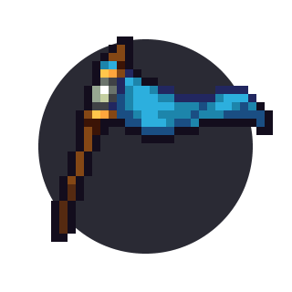
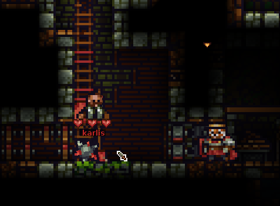
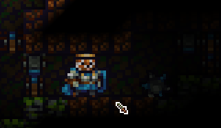
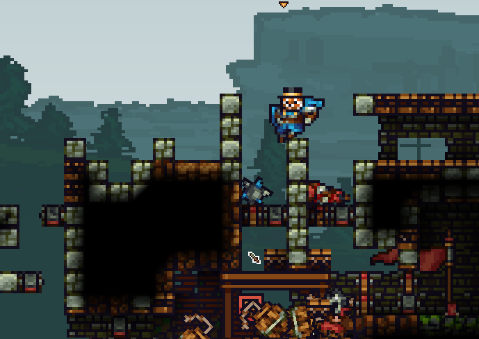
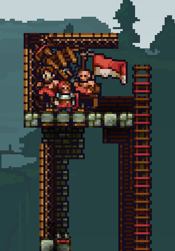
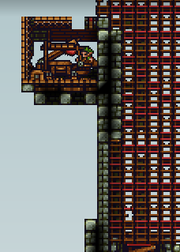

# Playing CTF

  

## Dropping resupplies (dropping mats)

__Every time you respawn, you should change on your tent/ballista to builder and back to knight.__ This way you drop 100 wood and 30 stone (resupplies) and your builders will love you. It may not seem like a lot, but it really helps your builders.

<video style="display:block; max-width:100%; height:auto;" src="webm/05-ctf/1.webm" controls loop="loop" preload></video> 

## Buying items

There is a lot of items to buy in CTF. The more people you kill, the more coins you gain. There's no much point in hoarding all the coins -- you lose some if you die. 

### Bombs

Most knights decide to buy bombs (knight shop, 25 coins). They're good for killing enemy builders and archers, especially when they try to escape from you. 

<video style="display:block; max-width:100%; height:auto;" src="webm/05-ctf/2.webm" controls loop="loop" preload></video> 

Using them to bomb jump to the enemy base also is a very good strategy.

<video style="display:block; max-width:100%; height:auto;" src="webm/05-ctf/3.webm" controls loop="loop" preload></video> 

You can also use them in this way -- if only one block thick wall (not doors) seperates you from the enemy builder, you can kill the enemy through the block:

<video style="display:block; max-width:100%; height:auto;" src="webm/05-ctf/4.webm" controls loop="loop" preload></video> 

Good for killing builders ratting in your tower.

If you're protecting a builder in a situation like this, you should shield up - this way the bomb doesn't kill them:

<video style="display:block; max-width:100%; height:auto;" src="webm/05-ctf/4two.webm" controls loop="loop" preload></video> 

### Burgers

Burgers are also a decent item (quarters, also known as food shop, 20 coins). They heal you to full health. You can eat them quickly by pressing V. It's useful when you're fighting and don't have much health -- just eat a burger. Using them greatly improves your survivability.

### Water bombs

They stun the enemy (knight shop, 30 coins). Good for stunning enemies when you're fighting several at once, or stunning archers/builders. Just stun anyone for easily kills. 
Countered if enemy has a sponge in inventory (as mentioned in the first chapter)

<video style="display:block; max-width:100%; height:auto;" src="webm/05-ctf/5.webm" controls loop="loop" preload></video> 

<video style="display:block; max-width:100%; height:auto;" src="webm/05-ctf/5two.webm" controls loop="loop" preload></video> 

### Sponges

If you have one in inventory (builder shop, 15 coins), you are stunned for shorter time when hit by water bomb. Good to buy if you know the enemy team has lots of archers spamming water.

### Mines

Mines are good (knight shop, 60 coins), especially when your team is on the defense. Place at least 1 in flagroom (if enemies get in there, they will be killed by the mine)

  

Place one in tunnels as well -- ratting enemies in most cases don't notice them and die.

  

Placing them next to enemy doors is good as well

  

### Kegs

Very good explosive (knight shop, 120 coins). Good for destroying enemy structures.

Don't fight enemies while holding it -- losing a keg is bad for your team.

<video style="display:block; max-width:100%; height:auto;" src="webm/05-ctf/6.webm" controls loop="loop" preload></video> 

Getting yourself launched from a catapult with a keg is a good tactic as well.

<video style="display:block; max-width:100%; height:auto;" src="webm/05-ctf/7.webm" controls loop="loop" preload></video> 

Kegs, aside from exploding after 6 seconds, explode on impact if they're lit and have enough velocity.

### Ballista

Good siege vehicle (siege shop, 200 coins), can be bought if you've got a lot of money. It lets people respawn on it, so I recommend putting it on top of your tower.

  

### Catapult

Another good siege vehicle (siege shop, 200 coins) -- lets you shoot people with it. Place on top of your tower.

  

### Arrows for your archers

If you know that you have any good archers in team, you can buy them various arrows, such as fire arrows (especially if enemies got any big wooden structures), water arrows (for stunning enemies) or bomb arrows (for destroying enemy siege vehicles or structures).

## Teamwork

Aside from dropping mats, there's some other stuff you should do.

### Protect your builders

Protect your builders that are trying to push the enemies and attack their base. Stay with them, kill enemies that try to attack them.

<video style="display:block; max-width:100%; height:auto;" src="webm/05-ctf/9.webm" controls loop="loop" preload></video> 

However, if the builder is trying to rat into the enemy base and places doors like in the gif below, leaving him to fight knights isn't a good idea.

<video style="display:block; max-width:100%; height:auto;" src="webm/05-ctf/10.webm" controls loop="loop" preload></video> 

In the gif, the knight opened the doors, trying to fight enemies, but died in the process. This causes the death of a builder in 99% situations. If the knight didn't try to attack and didn't die, he could've protected the builder from the builders with drills later on.

### Catch bombs

Builders and archers have no way to protect themselves from bombs. Catch enemy bombs and throw them back quickly to save them from certain death.

<video style="display:block; max-width:100%; height:auto;" src="webm/05-ctf/11.webm" controls loop="loop" preload></video> 

### Pick up materials

Pick up materials laying on the ground (order of importance: gold > stone > wood) and deliver them to a safe spot or to the closest builder. Do this especially after killing enemy builders.

<video style="display:block; max-width:100%; height:auto;" src="webm/05-ctf/12.webm" controls loop="loop" preload></video> 

## On the defense

While you're defending yourself from enemies pushing your tower, you should keep some stuff in mind. Some of these apply to other situations as well.

### Focus on the builder

Kill the builder at all costs. He's the most dangerous -- without him, it's much harder for enemy knights to get inside your base.

I recommend jumping from the top of the tower and just slashing him.

<video style="display:block; max-width:100%; height:auto;" src="webm/05-ctf/13.webm" controls loop="loop" preload></video> 

### Mass-keg

You can mass-keg the enemies if there are many of them. However, keep in mind that the enemies could catch it and use it against your tower - so sometimes (if you see a good player that could catch, for example) it's good to kill yourself with the keg.

<video style="display:block; max-width:100%; height:auto;" src="webm/05-ctf/14.webm" controls loop="loop" preload></video> 

<video style="display:block; max-width:100%; height:auto;" src="webm/05-ctf/14two.webm" controls loop="loop" preload></video> 

### Catch enemy kegs 

If you're quick enough, you can catch enemy kegs by jumping and spamming C when the keg is about to hit the ground.

<video style="display:block; max-width:100%; height:auto;" src="webm/05-ctf/16.webm" controls loop="loop" preload></video> 

Mostly applies to being on the offense - the enemy team may try to mass-keg you.

### Slash ballista bomb bolts

You can slash ballista bomb bolts with good timing. Greatly helps if you're under heavy siege.

<video style="display:block; max-width:100%; height:auto;" src="webm/05-ctf/17.webm" controls loop="loop" preload></video> 

### Shield enemy bomb arrows

You should shield enemy bomb arrows - especially if they're aimed at weak points in your tower or the flagroom

<video style="display:block; max-width:100%; height:auto;" src="webm/05-ctf/18.webm" controls loop="loop" preload></video> 

## On the offense

### Multi bomb jumps

Aside from 1-bomb bomb jumps, you may sometimes want to use multi bomb jumps to get to the enemy base:

2 bombs (1st bomb on ground, 2nd in hand):

<video style="display:block; max-width:100%; height:auto;" src="webm/05-ctf/33.webm" controls loop="loop" preload></video> 

3 bombs:

- Place 1st bomb on ground
- Light and put 2nd bomb in inventory
- Light 3rd bomb and replace it with the one in your inventory 

<video style="display:block; max-width:100%; height:auto;" src="webm/05-ctf/34.webm" controls loop="loop" preload></video> 

### Enemy tunnels

When you get to the enemy tunnel, constantly double slash it. This way, if any enemies go through it, you kill them easily (they're stunned from tunnel travel). In some cases, if someone travels and you don't have a double slash charged, you can use a single slash

<video style="display:block; max-width:100%; height:auto;" src="webm/05-ctf/19.webm" controls loop="loop" preload></video> 

If you're certain that they don't have a sawtrap on their other tunnels, you can also try using them to get to their base.

<video style="display:block; max-width:100%; height:auto;" src="webm/05-ctf/20.webm" controls loop="loop" preload></video> 

### Enemy siege vehicles

Generally, if it's a catapult, you should just destroy it (easy money), unless it still has wheels attached and you can use it to hurt the enemies. If you have enough time, capture it.

As for ballistas, depends on the situation. Generally, if you're safe on the enemy ballista, and no enemies are coming, capture it. If there are lots of enemies trying to get it back - destroy it, it gives you a lots of coins (just jabspam it). Keep in mind you can also swap to the builder on enemy ballistas to block enemies from coming.

### Keg jump

Bomb jumping with a keg in your hand is a decent strategy which allows you to hurt the enemy structures significantly.

<video style="display:block; max-width:100%; height:auto;" src="webm/05-ctf/666.webm" controls loop="loop" preload></video> 

## Random tricks

### Sawjump

Bombs explode when they get destroyed. If bombs explode at the same moment, you can make a pretty awesome bombjump. Saws are used for this. Works like this:

<video style="display:block; max-width:100%; height:auto;" src="webm/05-ctf/21.webm" controls loop="loop" preload></video> 

You can also do it with holding a keg in hand to get to the enemy base.

<video style="display:block; max-width:100%; height:auto;" src="webm/05-ctf/22.webm" controls loop="loop" preload></video> 

Another variation includes holding a crate with a builder in it.

### Keg + waterbomb

This also applies to TDM. If you explode a water bomb on a keg (with enough momentum) the keg will quickly go forward, like this.

<video style="display:block; max-width:100%; height:auto;" src="webm/05-ctf/23.webm" controls loop="loop" preload></video> 

Can be used to hurt enemy structures -- enemies most likely won't catch the keg.

### Mine + bomb

Mines need to stay still to be able to deploy -- so you can't deploy them in midair. However, you can deploy one on top of your enemy tower, and then push it forward with a bomb or a waterbomb.

<video style="display:block; max-width:100%; height:auto;" src="webm/05-ctf/25.webm" controls loop="loop" preload></video> 
