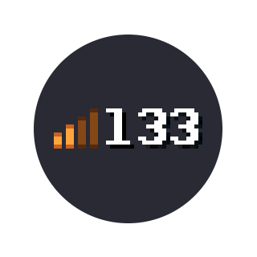

# Playing with lags

  

## Practice

If you want to learn how to play lag, it's basically like relearning KAG. 95% of being able to play with lag is just practice and training -- there's not much to be said in this chapter, however there are some things we'd like to say. But remember -- want to rek on 166 ping, play A LOT on 166 ping. Focus on getting used to your positioning. Timing and whatnot is important of course, __but getting used to where you really are is fundamental__

## Lag in KAG

With lag, you do things earlier than they actually happen. This includes stuff like slashing, shielding and moving. Both your positioning and attacks are delayed. Unfortunately, this leads to frustration and bad animations. For example, on your screen you shield a jab, but you didn't start shielding fast enough and it didn't happen on the server. So the enemy now also has a noanim for you (Read: [Dealing with noanims]), and is in a fake stunned state. These are the little things that you just notice over time, small things that happen on ping only -- as we said, just practice a lot and pay attention.

## How to play

Well, most of your playstyle on lags should consist of just slashes, preferably single slashes. They're the easiest to learn on ping (their different range and timing) if you just use them a lot, and if you keep baiting enemies then you can even kill some rather good US players without dying much. Of course, you should still jab after slashes.

We actually don't know if most moves are possible with lags, but they are for sure MUCH, MUCH harder to do. For example, shieldbashing feels very odd with lag, at least when you're on top of the enemy, so it is also a thing you should be careful with doing.

Instajabs are still possible with lag (tested on 166 ping), however you really need to train it a lot to be able to use it consistently -- avoid doing it in real matches until you train it. You could try setting up a server which you have 166 ping on and train the instajabs on there with the instajabbing bot (See: [Miscellanous - Tick Table, other small tricks, training bots]).

## Bomb jumping with lags

Well, this one is at least much easier with ping. You don't need to be able to do double bomb jumps or triple bomb jumps. Just put 4 lit bombs on ground and you will even gain lots more velocity than normal. Actually pretty useful, especially with kegs.

[gif]
