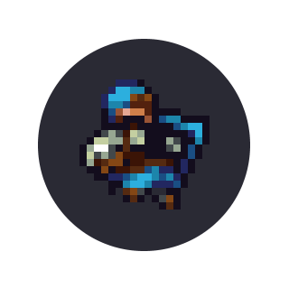

W.I.P. - WILL BE FINISHED SOON

# Dealing with noanims

  

## What are noanims?

Noanims are when animations desync between either you or your enemy's client and the server -- you see something else than what actually happened. Sometimes they are random, but sometimes they happen in specific situations as well. Lags, ping, and sometimes FPS may affect noanims.

## Play with sounds

__You should always play with your sounds on__. It's MUCH easier to know what is happening even without noanims, and they are basically a must with noanims. Usually, when someone has a noanim, they start charging a slash -- even with the noanim, you can hear them slashing.

## Paying attention to the enemy's headframe

Heads have a seperate frame for when someone is charging an attack. This is how the difference looks on the default male Knight head:

Normal frame:

[img]

Attack frame:

[img 2]

The most common situation is when the enemy's animation is shielding, but they have the normal attack head frame. In this case, they're actually slashing.

Keep in mind, not every head has a different attack frame.

## Paying attention to the enemy's mobility

You should also pay attention to the enemy's mobility. If they slightly jumps around backwards and forwards with their shield up or a stunned animation, they're also most likely slashing.

## Types of noanims

### Slash while shielding

Random noanim, more likely to appear on those who are able to do quick slashes, may or may not be related to shielding right after slashing. As mentioned earlier, you can see the enemy's head attack frame.

[gif 1]

### Slashes appearing as jabs 

Random noanim, appears when the enemy is able to do quick slashes. On your screen, they appear to not actually charge their attack enough for it to be a slash, so you see them jab you, but they actually charged a slash. Also happens sometimes with doubleslashes (appear as slash+jab or double jab).

[gif 2]

Since it appears as a jab for you, if you shielded the attack he will get the stunned animation.

### Stun animation after jabbing shield

Sometimes, the enemy may appear to jab your shield, and they get stunned on both your screen and the server, but not on their screen. They can still move around, but they can't slash or shield, even if they can see animations for those actions on their own screen. 

Shielding person's POV:

[gif 3]

Jabber's POV:

[gif 4]

May cause further noanims (after trying to do such actions on their screen)

If you think you jabbed the enemy's shield (and these little yellow sparks appeared), and you're still able to move, you should run away from the enemy as quickly as possible - you can't shield now, after all.

### Stun animation after jabbing shield version 2

In this case, on your screen they jabbed your shield, AND did 1 heart of damage to you. They got stunned on your screen only, and their slashes/shield still work. They didn't jab your shield on the server or on their screen, hence the damage.

[gif 5]

### Shield animation after jabbing shield

This is when the enemy jabs your shield and gets stunned, on both the server and their screen. He may appear to shield on your screen, but he's actually stunned (you can see because he doesn't move), so you can damage him. However, if you attempt to jab him, you damage him, but get stunned on your screen (but not on their screen)

[gif 6]

### Stun animation after enemy's instajab

After the enemy does an instajab (mentioned in [Knight IV: Expert] section), on your screen you may have been shielding him, but you actually weren't. Magic. The enemy appears to be stunned for you then, but he's actually not -- he can still move around, slash and shield.

[gif 7]
