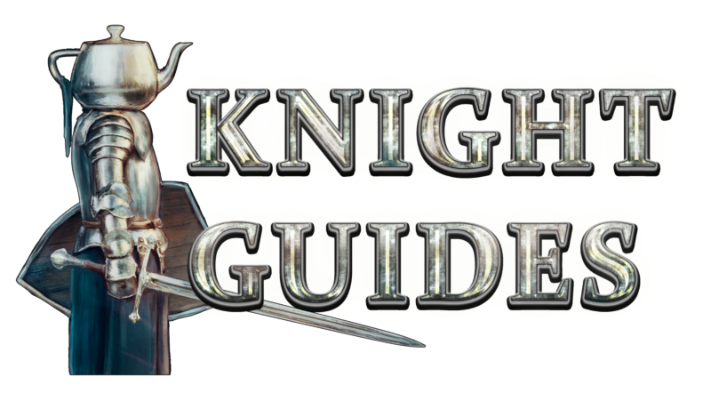

--- 
title: "Knight Guides"
subtitle: "Tender is the Knight"
author: "by Bunnie and deynarde"
date: "`r format(Sys.time(), '%d/%m/%Y')`"
site: bookdown::bookdown_site
output: bookdown::gitbook
documentclass: book
bibliography: [latex/book.bib, latex/packages.bib]
biblio-style: apalike
link-citations: yes
github-repo: deynarde/kag-knight-guide
description: "A KAG knight guide for both new and experienced players."
---

# Introduction {-}

  

We’ve read many tutorials concerning the knight gameplay, both on THD forums and Steam community hub and most of them were either shallow or outdated. Considering we have lots of new players coming with the recent KAG F2P release we decided to write this new player friendly guide.

We hope it'll help people who try to get better at knight. We’re going to cover everything: improving your skills on various levels, how to play on CTF, how to deal with high ping or bugs, and every knight trick/move you can do in this game and much more. It may seem like a lot, but knight combat is very extensive and if you really want to get better this guide will certainly help you.

> For just a collection of knight tips and tricks see the [Knight Compendium](https://deynarde.github.io/kag-knight-compendium/).

> For a tutorial on playing as builder see [Builder Guides](https://deynarde.github.io/kag-builder-guide/).

> Also you can contact us on [KAG Discord](https://discord.gg/kag) (`bunnie#8671`, `deynarde#4491`).
